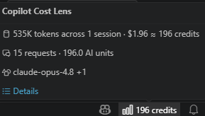
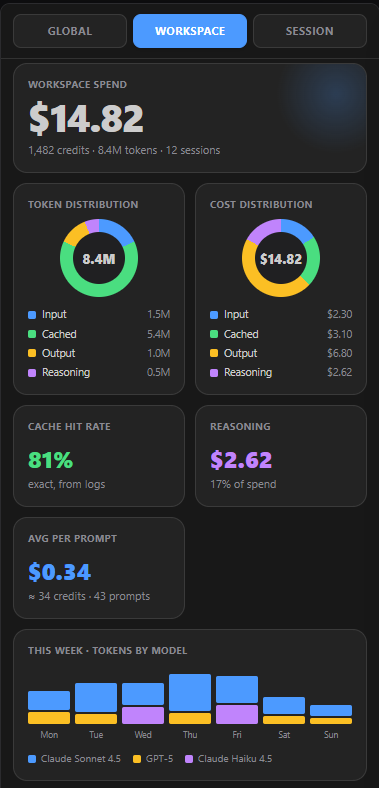
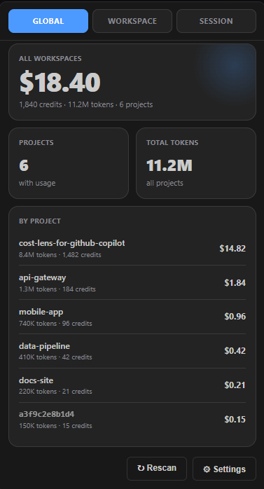
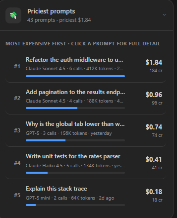
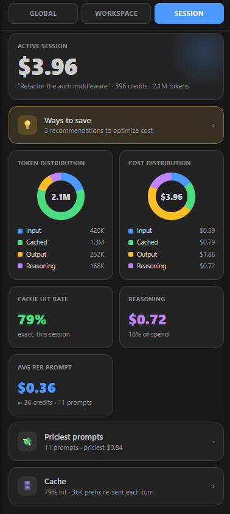
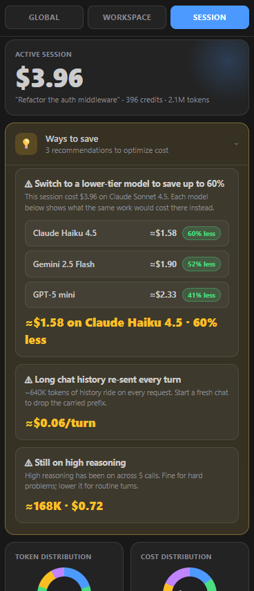

# Cost Lens for GitHub Copilot

### Find out what you're actually spending on GitHub Copilot.

Real AI credits, cost and tokens measured from Copilot's own request logs.

---

## See your spend at a glance

A live badge in the status bar keeps your running credit total in view. Hover for the full breakdown.

  

## A dashboard for every scope

Four tabs **Global**, **Workspace**, **Session** and **Optimize** each a clean bento grid of where
your tokens and money actually go. Open it in the sidebar, or full-screen from the status-bar badge.

  

  

## Find your priciest prompts

Every prompt ranked by what it really cost in billed credits. Click any one for the full token
breakdown, prompt and reply text, tools used, and a per-call table.

  

## Spend less, automatically

The **Optimize** tab pulls every “spend less” signal into one place: ranked, data-backed tips (long
chat history, idle tools, high reasoning left on, and which cheaper model would do the same work for
less), a worst-first breakdown of prompting habits detected from your own logs, and a short “how to
do better” playbook. Expand any tip for the full breakdown and per-model estimates.

  
  &nbsp;
  

---

## ✨ What you get

- 📈 **Live status-bar badge** your credit total, always visible
- 🗂️ **Global / Workspace / Session** views with token & cost donuts, openable full-screen
- 💸 **Priciest prompts** ranked by real billed credits, click for full detail
- ♻️ **Cache & tools** breakdowns see what rides on every request
- 🧩 **Optimize tab** ranked tips, detected prompting anti-patterns, and a best-practice playbook
- 💡 **Actionable tips** including *“switch to this model to spend X% less”*
- 🔬 **Measured, not guessed** read from Copilot’s own logs, anchored to billed credits

## 🚀 Get started

1. Open the **Cost Lens** view from the activity bar.
2. Click **Enable token logging** and reload the window.
3. Send a Copilot chat message your real cost appears.

## 🔒 Private by design

Everything runs locally. The extension only reads logs Copilot writes on your machine and sends
nothing anywhere. Prompt and reply text can be redacted with one setting.

---

Not affiliated with, endorsed by, or sponsored by GitHub or Microsoft. 
“GitHub” and “Copilot” are trademarks of their respective owners.

